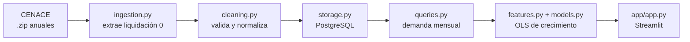

# Pronóstico mensual de demanda eléctrica por región de México

[](https://github.com/jaflores9891-glitch/pronostico-demanda-electrica/actions/workflows/ci.yml)

**App en vivo:** https://pronostico-demanda-electrica-mx.streamlit.app/

## Pregunta

> ¿Cuánta energía demandará cada región del sistema eléctrico mes a mes en los próximos 12 meses, y cuáles crecerán más respecto al año anterior?

## Resultado

Un modelo de regresión OLS del **crecimiento anual por región** reduce el error **16%** frente al baseline estándar de series estacionales:

| Modelo | WAPE (sep-2025 a ago-2026) |
|---|---|
| Promedio de 12 meses | 10.72% |
| Naive estacional (repetir el año anterior) | 3.83% |
| **OLS de crecimiento anual** | **3.20%** |
| LightGBM | 4.28% |

- El OLS gana en 7 de 9 regiones; la mayor mejora es en Baja California Sur (10.2% → 6.1%), la región con la tendencia de crecimiento más fuerte.
- LightGBM pierde frente al naive: con 288 observaciones y años afectados por el clima, sobreajusta. Más complejidad no garantizó un mejor pronóstico.
- Para el total del Sistema Interconectado Nacional, sumar los pronósticos regionales (1.87%) es tan preciso como pronosticar la serie agregada (1.88%), y además da el detalle por región.

## Datos

- **Fuente:** [CENACE, Estimación de la Demanda Real por Balance](https://www.cenace.gob.mx/Paginas/SIM/Reportes/EstimacionDemandaReal.aspx), enero 2022 a agosto 2026.
- **9 regiones:** las 7 del Sistema Interconectado Nacional (CEN, NES, NOR, NTE, OCC, ORI, PEN) y los sistemas aislados de Baja California y Baja California Sur.
- **368,063 registros horarios** → 504 registros mensuales (56 meses × 9 regiones).
- Se usa solo la **liquidación 0**: es la versión disponible ~14 días después de la operación, la única que existiría al momento de pronosticar.

## Arquitectura



- **Pipeline reproducible** con un solo comando; la carga es idempotente (TRUNCATE + INSERT en una transacción).
- **PostgreSQL** como fuente única de verdad: Docker en local, Neon en producción. Solo cambia `DATABASE_URL`.
- **Calidad:** 12 tests con pytest, Ruff y GitHub Actions en cada push.

## Decisiones clave

- **Objetivo del modelo:** el crecimiento interanual `log(demanda_dia / demanda_dia_año_anterior)`. Corrige la debilidad del naive estacional (asume crecimiento cero) y evita que los árboles tengan que extrapolar.
- **Sin fuga de información:** el horizonte es de 12 meses, así que solo se usan variables conocidas al momento de pronosticar (lag de 12 meses). Validación con corte temporal, nunca al azar.
- **Efecto calendario:** se modela la demanda por día y se multiplica por los días del mes; febrero no es "bajo", solo es corto.
- **Cambios de horario:** los días de 23 y 25 horas se conservan porque son energía real; normalizarlos alteraría el total mensual.
- **Formato alternativo:** 18 archivos de agosto de 2022 traen otros nombres de columnas; se verificó que `BALANCE` = generación + importación − exportación antes de mapearlo.

## Limitaciones

- Sin temperatura: el modelo no puede anticipar veranos excepcionales.
- El crecimiento promedio no capta desaceleraciones (Península: el modelo proyecta 6% en un año en que casi no creció).
- Evaluación con un solo periodo de prueba; una validación con varios cortes daría una estimación más robusta.

## Cómo correrlo

Requisitos: [uv](https://docs.astral.sh/uv/), Docker y `libgomp1` (en Ubuntu/WSL: `sudo apt-get install -y libgomp1`).

```bash
git clone https://github.com/jaflores9891-glitch/pronostico-demanda-electrica.git
cd pronostico-demanda-electrica
uv sync
cp .env.example .env          # ajusta la contraseña y DATABASE_URL
docker compose up -d
```

Descarga de la página de CENACE los .zip anuales de "Por Balance" (Fecha Inicial / Fecha Final → *Descargar en archivo .zip*) y guárdalos como `data/raw/cenace/zip/balance_AAAA.zip`. Luego:

```bash
uv run --env-file .env python -m pronostico_demanda_electrica.pipeline
uv run --env-file .env streamlit run app/app.py
uv run pytest
```

## Estructura

```
├── app/app.py                      # app de Streamlit
├── src/pronostico_demanda_electrica/
│   ├── ingestion.py                # extracción de los .zip
│   ├── cleaning.py                 # lectura y validación de cada CSV
│   ├── storage.py                  # tabla y carga en PostgreSQL
│   ├── pipeline.py                 # orquesta ingesta → limpieza → carga
│   ├── queries.py                  # demanda mensual por región
│   ├── features.py                 # lag_12 y crecimiento
│   ├── baselines.py                # naive estacional y promedio
│   ├── models.py                   # OLS, LightGBM y pronóstico a futuro
│   └── metrics.py                  # MAE y WAPE
├── notebooks/                      # EDA, baselines, modelos, SIN vs regiones
├── tests/                          # pytest
├── docs/                           # notas y decisiones de cada fase
└── docker-compose.yml              # PostgreSQL 18 local
```

## Autor

Jesús Flores · [GitHub](https://github.com/jaflores9891-glitch)